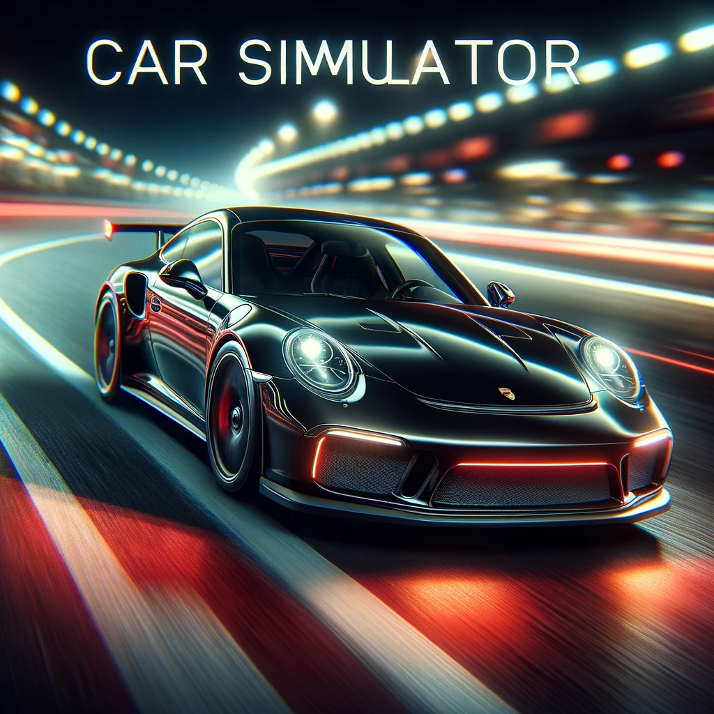
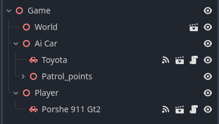
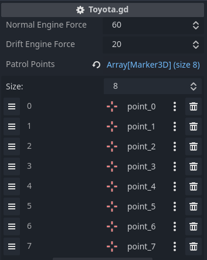
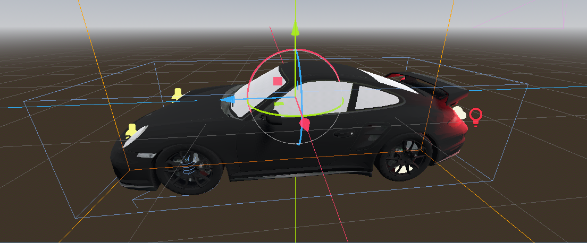
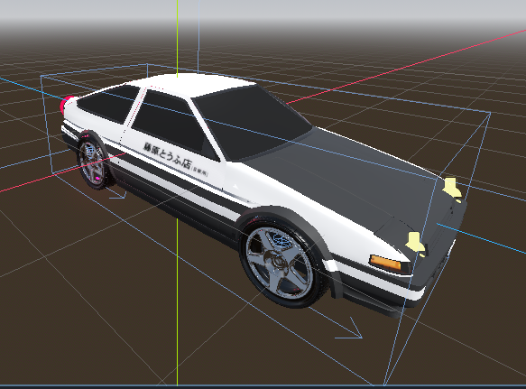
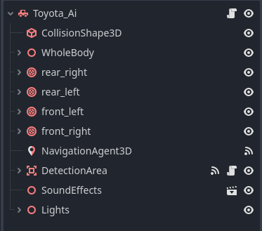
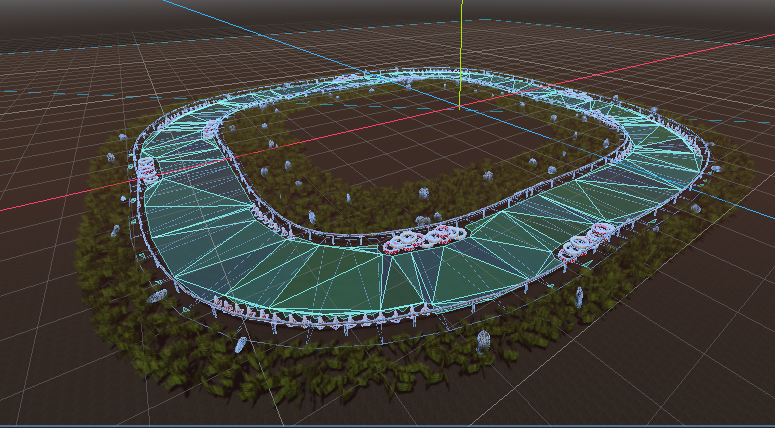
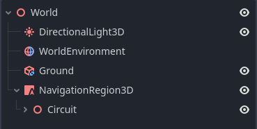
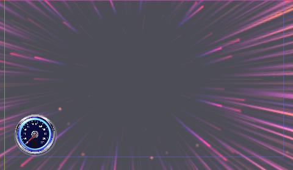

<!-- Improved compatibility of back to top link: See: https://github.com/othneildrew/Best-README-Template/pull/73 -->
<a name="readme-top"></a>

<!-- PROJECT LOGO -->
<br />
<div align="center">
  <a href="https://https://github.com/Hojun-pot/Carsimulator_With_Godot">
    
  </a>

  <h3 align="center">Best-README-Template</h3>

  <p align="center">
    This is a CarSimulator game!
    <br />
    <a href="https://youtu.be/seASWeBMgls">Youtube Demo</a>
  </p>
</div>


<!-- TABLE OF CONTENTS -->
<details>
  <summary>Table of Contents</summary>
  <ol>
    <li>
      <a href="#about-the-project">About The Project</a>
      <ul>
        <li><a href="#built-with">Built With</a></li>
        <li><a href="#about-the-scene">About The Scene</a></li>
        <li><a href="#function">Function</a></li>
      </ul>
    </li>
    <li>
      <a href="#getting-started">Getting Started</a>
      <ul>
        <li><a href="#prerequisites">Prerequisites</a></li>
        <li><a href="#installation">Installation</a></li>
      </ul>
    </li>
  </ol>
</details>


<!-- ABOUT THE PROJECT -->
## About The Project

[![Product Name Screen Shot][product-screenshot]](https://example.com)

I created this car simulator using the Godot Engine and Adobe Illustrator, focusing on implementing the features of modern car games using the Godot Engine. This project is not just a simulator; it's a comprehensive learning tool for understanding vehicle dynamics in furthur project. The Porsche car is user-drivable and includes the following features: Booster, Drift, Jump, Sideswipe, Gear Shift, Respawn, Camera Switch, Rear Lights, Headlights On/Off, Music On/Off. The Toyota car is AI-driven, moves along designated points on the map, avoids obstacles, and has the interaction of honking and turnning light on when it encounters the user.

### Why This Project:
* To understand the godot engine interaction and physical system.
* To learn the process implementing Ai car.

This project will evolve with time, adding more features and scenarios. Feel free to contribute or suggest improvements by forking this repository.

<p align="right">(<a href="#readme-top">back to top</a>)</p>


### Built With

This project was built using these technologies:

* [Godot Engine](https://godotengine.org/)
* [Adobe Illustrator](https://www.adobe.com/products/illustrator.html)

<p align="right">(<a href="#readme-top">back to top</a>)</p>

### About The Scene
In this section, we introduce each major scene, detailing which game objects and scripts are included, and the purpose for which the scene was created.

### Game


In the game, this is the main scene that includes all scenes to be utilized, and it is the scene that will be executed when the user runs the game. 
It includes elements such as the World, Ai car, Player, and Patrol_points. 


By placing Patrol points on the circuit and integrating them into the AI car's path, it assists the car to navigate along the circuit.
### Porshe 911 Gt2

### Porche 911 gt 2



The source of the Porsche 3D model is as follows: 

* [https://model-copy.info/product_info.php?language=en&products_id=12233](https://model-copy.info/product_info.php?language=en&products_id=12233)


 The scene comprises objects such as Model, CollisionShape, Rears, GPUParticle, SoundEffect, Light, Camera, and CanvasLayer. The GPUParticle includes effects like smoke from the wheels when drifting, exhaust fumes from the car when it starts, and neon sign effects when the rear lights are on and the car is in motion. Through the CanvasLayer, real-time information like booster effects, gear changes, and current speed can be viewed on a 2D panel on the screen. Additionally, these objects can be controlled according to the user's input, as dictated by the "CarTestWhile.gd" script.

### Toyota model



The source of the Toyota 3D model is as follows:  

* [https://sketchfab.com/3d-models/toyota-corolla-ae86-trueno-fe02fba6302e450ea8424591493341ea](https://sketchfab.com/3d-models/toyota-corolla-ae86-trueno-fe02fba6302e450ea8424591493341ea)




This scene includes the 3D model of the Toyota AI along with CollisionShape, Rear, NavigationAgent for calculating its current position, DetectionArea for sensing objects, SoundEffect, and Lights. Additionally, this AI scene follows the "Toyota.gd" script, which allows it to automatically drive on the road at a constant speed. If it detects the user, it will honk its horn and turn on its lights.

### World


The source of the Circuit 3D model is as follows:  

* [https://sketchfab.com/3d-models/road-assets-low-poly-b3f20db2718242a3815bb400ffcb45da](https://sketchfab.com/3d-models/road-assets-low-poly-b3f20db2718242a3815bb400ffcb45da)



The World scene contains a DirectionalLight3D responsible for sunlight, the environment, ground, and the circuit. The world environment is detailed with settings for fog intensity, visibility, shadows, and lighting.

<p align="right">(<a href="#readme-top">back to top</a>)</p>

### Function


This game fundamentally supports input compatibility with a keyboard and mouse, as well as Xbox controllers. 
Before starting the game, please check the project's input map to ensure smooth gameplay.



Above is a 2D panel that appears on the user's gameplay screen. It displays gear shifts, the real-time speed (km/h) of the Porsche, and effects on the screen when the booster is used.

Additionally, for an enhanced user experience, the game offers features like traction control for drifting, free camera switching, a booster, respawn, quick left and right sidestep maneuvers (sideswiping), gear shifting that can be adjusted with increasing speed, turning headlights on and off, and the option to play or stop music.

<p align="right">(<a href="#readme-top">back to top</a>)</p>

<!-- GETTING STARTED -->
## Getting Started

To get a local copy up and running, follow these steps.

### Prerequisites

Ensure you have the following installed:
* Godot Engine
* Adobe Illustrator (for editing assets)

### Installation

_Below is an example of how you can instruct your audience on installing and setting up your app. This template doesn't rely on any external dependencies or services._

1. Download Godot [https://godotengine.org/](https://godotengine.org/)
2. Clone the repo
   ```sh
   git clone https://github.com/your_username/Car-Simulator.git
3. Run the Scene

<p align="right">(<a href="#readme-top">back to top</a>)</p>


<!-- USAGE EXAMPLES -->
## Usage

This project complies with copyright laws, and additionally, the sources used will be credited below.

THE SOUNDS ARE DOWNLOADED FROM :
* [https://pixabay.com/](https://pixabay.com/)

THE SONGS ARE DOWNLODED FROM :
* [https://ncs.io/](https://ncs.io/)

<p align="right">(<a href="#readme-top">back to top</a>)</p>